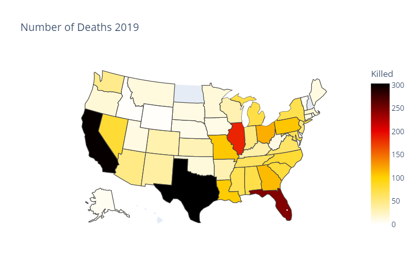

# Group 39 Project Final Report - Gun Violence in America
#### Nolan Nishikawa - Rhys Smith - Luke Chapman

---
## Introduction
As many of us are aware, there are many problems in the United States that are constantly in news headlines and on social media. These things can range from being at a massive scale such as what is going on with the military or something as small as the latest thing that a celebrity has said on twitter. However, one topic that seems to always be pervasive in headlines has to deal with mass shootings and gun violence. With this also comes the many heated debates on what should be done in an attempt to try and fix this issue. While this topic in itself is something that is interesting and something that most people could debate about for days, what our group was wanting to look at was actual statistical evidence to see how bad this issue really is. As a result, we have found a data set that contains information about mass shootings in the United States, with mass shootings being defined as cases where there have been 4 or more victims as a result of the mass shooting (victims in this case refers to both killed and injured). The data set, spanning from the years 2014 to 2021, includes things such as the dates, locations, number of people killed, and number of people injured in each incident. 

## Explorator Data Analysis (EDA)
One of the things that was immediately made apparent was how severe mass shootings in the United States have been. One of the first things that was made apparent was just the sheer number of shootings that took place between 2014 and 2021. Just by looking at the number of cases, one of the first things that we can see is that there have been 2930 cases of gun violence that fall under the earlier definition of mass shootings. This number alone is already something that most people would be shocked at hearing, but this only gets more shocking when it is made apparent that the number of cases, 2930, is larger than the number of days in 8 years (also noting the fact that in the data set, the year 2021 only had data for about half of the year). That is an average of over one shooting every day over the span of 8 years. 

Another thing that our EDA made clear was the distribution of mass shootings in each of the states, with Illinois and California being the two most dangerous states, and Wyoming and Vermont being the two safest.

One final thing that was made clear, building off the last point made, is the distribution of people killed is each state, as well as the distribution of people injured in each state. The former point was looking at mass shootings as a whole, where as in this section we are going to break down these shootings and look at how lethal each case was.

### Number of Deaths by State

An alternative view of the above graph would be:

### Number of Injuries by State

An alternative view of the above graph would be:

Overall, through looking at our EDA's, we found that a lot of our preconceived notions about gun violence were validated by the data presented. There were also some cases where out data showed us that the situation with gun violence in the United States was much worse than we originally thought. Edit to save thing