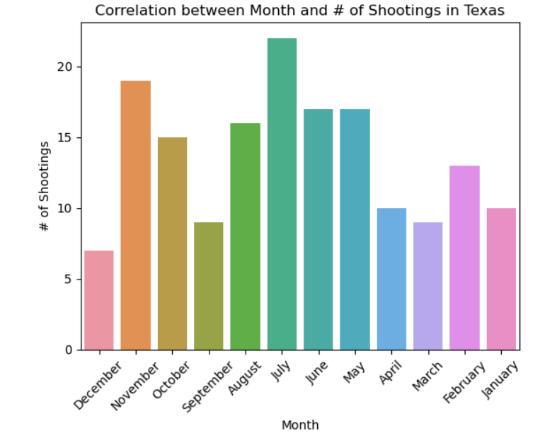
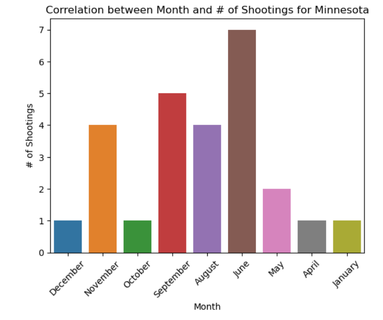

# Group 39 Project Final Report - Gun Violence in America
#### Nolan Nishikawa - Rhys Smith - Luke Chapman

---
## Introduction
As many of us are aware, there are many problems in the United States that are constantly in news headlines and on social media. These things can range from being at a massive scale such as what is going on with the military or something as small as the latest thing that a celebrity has said on twitter. However, one topic that seems to always be pervasive in headlines has to deal with mass shootings and gun violence. With this also comes the many heated debates on what should be done in an attempt to try and fix this issue. While this topic in itself is something that is interesting and something that most people could debate about for days, what our group was wanting to look at was actual statistical evidence to see how bad this issue really is. As a result, we have found a data set that contains information about mass shootings in the United States, with mass shootings being defined as cases where there have been 4 or more victims as a result of the mass shooting (victims in this case refers to both killed and injured). The data set, spanning from the years 2014 to 2021, includes things such as the dates, locations, number of people killed, and number of people injured in each incident. 

## Explorator Data Analysis (EDA)
One of the things that was immediately made apparent was how severe mass shootings in the United States have been. One of the first things that was made apparent was just the sheer number of shootings that took place between 2014 and 2021. Just by looking at the number of cases, one of the first things that we can see is that there have been 2930 cases of gun violence that fall under the earlier definition of mass shootings. This number alone is already something that most people would be shocked at hearing, but this only gets more shocking when it is made apparent that the number of cases, 2930, is larger than the number of days in 8 years (also noting the fact that in the data set, the year 2021 only had data for about half of the year). That is an average of over one shooting every day over the span of 8 years. 

Another thing that our EDA made clear was the distribution of mass shootings in each of the states, with Illinois and California being the two most dangerous states, and Wyoming and Vermont being the two safest.

One final thing that was made clear, building off the last point made, is the distribution of people killed is each state, as well as the distribution of people injured in each state. The former point was looking at mass shootings as a whole, where as in this section we are going to break down these shootings and look at how lethal each case was.

### Number of Deaths by State

An alternative view of the above graph would be:

### Number of Injuries by State

An alternative view of the above graph would be:

Overall, through looking at our EDA's, we found that a lot of our preconceived notions about gun violence were validated by the data presented. There were also some cases where out data showed us that the situation with gun violence in the United States was much worse than we originally thought.

---

## Question 1 + Results (Rhys' Section)
### What percentage of shootings can be considered mass shootings and has the number of shootings been increasing in recent years?
The accepted definition of a mass shooting is defined as: "four or more people injured or killed per incident of gun violence." With that in mind, I have been looking at the frequency of injured or killed per incident analyzed. 
####

####
In the above image, we can see that on average about 4 people were injured per incident. With some incidents even having greater than 15 or 20 people injured. 
####

####
In the above plot, it appears that on average a little over 1 person was killed per incident recorded. With some rare but extreme cases where around 20 people were killed.

A majority of the shootings that have occurred in the past 7 years across the United States can be considered mass shootings. After analyzing our data, I can say that on average 4.97 people are either killed or injured per incident recorded which is greater than the required 4 killed or injured to meet the definition. This is quite conerning as I intitially thought mass shootings were relatively rare and did not make up a majority of the shootings over the past 7 years in the United States.
####

####

In the above image, we can see that the number of shootings has steadily risen over the 7 year period our data analyzed. 2020 appears to be by far the worst year which over 600 incidents alone, which is a very high number even considering the ongoing pandemic. Even if we ignore the year 2020, the bar graph stills shows an upward trend in the number of shooting incidents between 2014 and 2019. Which makes us question whether we should be more concerned about gun violence in our everyday lives and what can be done to help the situation and bring down the number of shootings.

For more information, [click the link here to take a more thorough look at my analysis notebook](notebooks/analysis1.ipynb)

####

---

## Question 2 + Results (Nolan's Section)
### How does the time that shootings take place affect how many shootings there are? And if so, what outside factor could possibly influence these results regarding the shootings?

In regards to my research question, one of the first things that I began to take a look at was the time of year that these shootings take place. Specifically, I wanted to see if there was some sort of trend regarding the number of shootings and what the current month of the year. With this, I also began to ask the further question if the weather during these months may or may not have played a factor in the number of shootings that have occured

As we can see in the graph above, there is a trend that is made very apparent and is noticed within the first couple seconds of looking at the graph. This trend shows that from 2014 to 2020, there is a significantly higher number of shootings take place during what would be the warmer/summer months of the year. From a logical standpoint (albeit, a very morbid one), this trend in data does make some sense. The warmer weather means it is far more likely that there are going to be people out and about in public, leading to a far higher chance that a mass shooting may occur. 

While this point in itself is worthwhile, I began to look at this and feel somewhat conflicted. Not every state is going to share the same range of weather and seasons. For example, the climate in Texas is very different from the climate in New York, with Texas being warmer year round and New York having a much colder winter. As a result, this left me questioning the validity of the graph above. For the United States as a whole, the above graph does a good job and showing the distribution of shootings for each month, it does not give you the entire picture. As such, did a deeper dive into individual states to see whether the earlier hypothesis of 'more shootings happen during the warmer/summer months' is still true. 

In the above, the number of shootings each month has been broken up just for the State of Texas. As we can see, the number of shootings does appear to somewhat follow the same trend as before. However, there is much more variability in all the bars on the graph. From this we can infer that in a warmer state, there is going to be higher numbers of shootings during what would typically be the colder months of the year. However, just this one graph may be not be substantial enough, so we can continue to look at other warmer states, like Arizona.

In the graph for Arizona, we see that the earlier hypothesis is almost completely untrue. This is due to the highest number of shooting occuring in months that would typically be seen as colder months. As a result, we can now make a firm conclusion that while yes, some of these warmer states may still follow the trend of  summer months having more shootings, overall there is much more variability, with there being some times where the state breaks away from the trend completely. 

However, what about states that get colder during the winter?

In the above two graphs, we can see that, the trend of more shootings during the summer months rings much more true. Even from just taking a glance at the graph for New York, it is made very clear that there are higher levels of gun violence in the months of June, July, and August. The same can be said for Minnesota where June has many more shootings than most of the other months of the year. From this, we can make the assumption that states that are going to get colder in the winter are going to more closely follow the trend the the entirety of the United States follows. 

After looking at both warmer and colder states, we can begin to make more reasonable assumptions for the United States as a whole. With this, we can determine that overall, the trend that United States follows is a trend that fits the data, with this trend showing that there is a tendency for mass shootings to occur more frequently during warmer months. It is still important to note the trend of each state individually, with warmer states having a trend with much more variability, while colder states tend to follow the same curve as the United States. 

For more information, [click the link here to take a more thorough look at my analysis notebook](notebooks/analysis2.ipynb)

---

## Question 3 + Results (Luke's Section)

---

## Conclusion